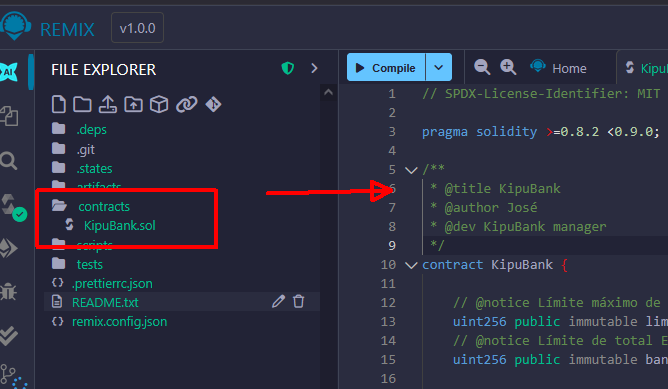
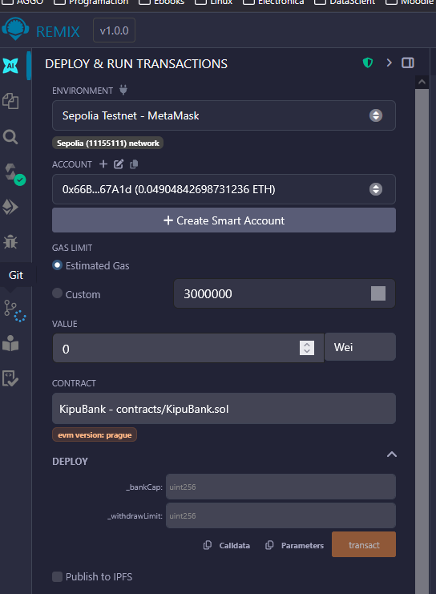
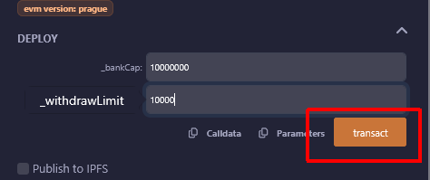
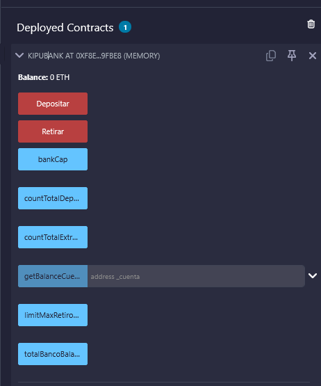
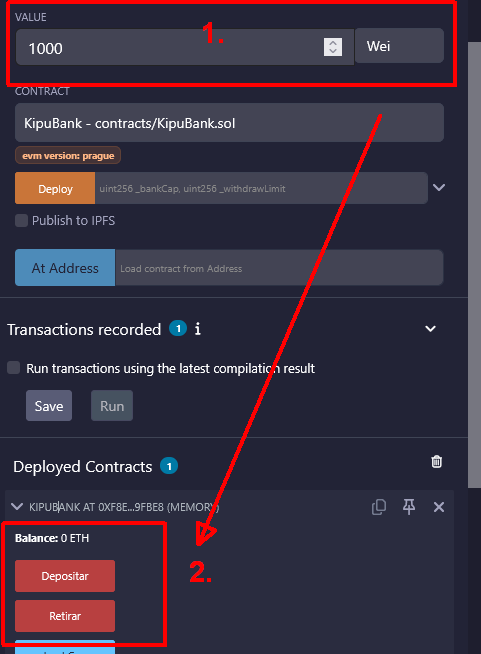
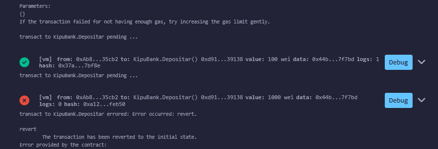

# Kipu-Bank

## Deploy final en Sepoia Test:

Ultima corrección al contrato:

https://eth-sepolia.blockscout.com/tx/0x875f550c54171e7ffa6ac315461287af0bdcb2e78b55ef815c4c7f943dfbaee9

https://sepolia.etherscan.io/tx/0x875f550c54171e7ffa6ac315461287af0bdcb2e78b55ef815c4c7f943dfbaee9

~~https://eth-sepolia.blockscout.com/tx/0xa1b1ee4b2fdf813fa365cb788b3bab7021e91581255746ceb2e39b92e1f05f75~~

~~https://sepolia.etherscan.io/tx/0xa1b1ee4b2fdf813fa365cb788b3bab7021e91581255746ceb2e39b92e1f05f75~~

## Descripción
KipuBank es una aplicacion de smart-contract, con fines didactivos, que simula un vault o banco personal en Etherium.

Los usuarios pueden depositar y extraer ETH bajo ciertas restricciones de limites totales del vault (banco) y de extraccion.

Reglas:

    - Deposito: Los usuarios pueden enviar ETH al contrato y este se registra en su saldo personal.

    - Extraccion: Existe un limite fijo maximo de extraccion por transaccion definido al momento de creacion del contrato.    

    - Limite de capacidad: se fija un limite maximo al momento de creacion del contrato que define el maximo total de la capacidad del vault.

    - Informar de eventos exitosos o fallas (revert)

    - Informar de balances por cada usuario y totales del vault.

#### Despliegue contrato en Remix

Estando en Remix se importa el archivo "KipuBank.sol" en nuevo proyecto.

Para hacer le deploy  del contrato  en la red de Sepolia se selecciona "Deploy &Run Transactions:

Se debe inicializar con valores adecuados y luego "transact": 

Si se hizo el deploy correctamente debe aparecer abajo de todo:

Para hacer pruebas solo se debe setear el valor de deposito o extraccion y hacer click en los botones visibles:

Cualquier operacion exitosa o con errores se observa en la caja de mensajes de Debug:

